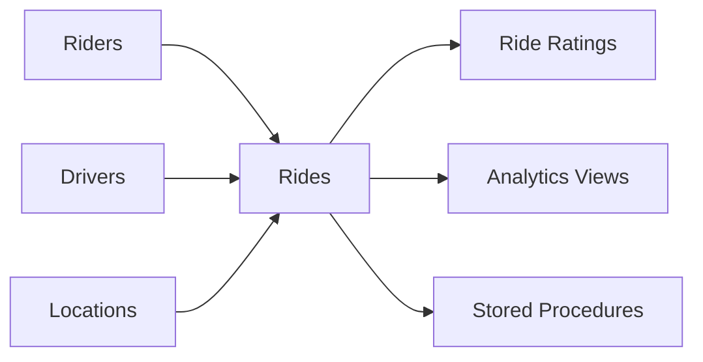

<div align="center">

# 🚖 Ride-Sharing Analytics Database

### Enterprise MySQL Backend for Ride-Hailing Platforms

*A production-inspired relational database that powers ride-sharing operations through optimized schema design, analytical reporting, reusable SQL views, and stored procedures.*


</div>

---

# 📖 Overview

Modern ride-sharing platforms rely on far more than simple CRUD operations. They require highly structured relational databases capable of tracking millions of rides while supporting operational reporting, driver analytics, dynamic pricing, and business intelligence.

This project simulates the backend database architecture of a ride-sharing platform similar to **Uber** or **Lyft**, demonstrating advanced SQL techniques, reusable reporting layers, and production-inspired schema design.

Rather than focusing solely on data storage, the project emphasizes **performance, maintainability, analytical reporting, and data integrity**.

---

# ✨ Core Features

## 🚖 Ride Management

- Driver & Rider Management
- Ride Lifecycle Tracking
- Pickup & Drop-off Locations
- Dynamic Surge Pricing
- Payment Tracking
- Rating System

---

## 📊 Operational Analytics

Generate insights including:

- Revenue Analysis
- Ride Demand Trends
- Driver Performance
- Peak Hour Analysis
- Popular Routes
- Zone Activity
- Payment Statistics

---

## 🛡 Enterprise Data Integrity

Database-level validation ensures reliable and consistent data through:

- CHECK Constraints
- Foreign Key Relationships
- Valid Geographic Coordinates
- Rating Validation
- Positive Fare & Distance Rules

Critical business rules are enforced inside the database rather than relying solely on application logic.

---

# 🏗 Database Architecture



---

# 🗄 Database Schema

| Table | Description |
|--------|-------------|
| **drivers** | Driver profiles, ratings, vehicle information, active status |
| **riders** | Rider accounts, payment preferences, loyalty program |
| **locations** | Geographic locations with latitude, longitude, and service zones |
| **rides** | Complete trip history including pricing, distance, duration, and ride status |
| **ride_ratings** | Mutual rider-driver feedback and ratings |

---

# 📈 Analytics Engine

The reporting layer provides actionable business insights through optimized SQL queries.

### 🚦 Ride Performance

- Total Rides
- Revenue
- Average Fare
- Ride Duration
- Distance Analysis
- Fare per Kilometer

---

### ⏰ Demand Trends

- Hourly Ride Distribution
- Daily Ride Activity
- Peak Demand Detection
- SQL-Based ASCII Visualizations

---

### 👨‍✈️ Driver Analytics

- Earnings
- Completed Trips
- Average Ratings
- Driver Performance Rankings

---

### 🌍 Geographic Intelligence

- Pickup Hotspots
- Drop-off Hotspots
- Zone-to-Zone Demand
- Most Popular Routes

---

### 💳 Payment Analytics

- Payment Method Distribution
- Revenue by Payment Type
- Transaction Volume

---

### 🔍 Data Quality Audits

Automated validation identifies:

- Invalid Ride Durations
- Non-Positive Distances
- Incorrect Fare Values
- Rating Coverage
- Data Consistency Issues

---

# 📚 Reporting Views

The project exposes reusable SQL views designed for dashboards and BI tools.

| View | Purpose |
|------|----------|
| **daily_performance_dashboard** | Daily operational KPIs |
| **driver_earning_summary** | Driver earnings & ratings |
| **hotspot_locations** | Pickup & drop-off activity |

---

# ⚙ Stored Procedures

Parameterized procedures simulate backend API calls.

### GetRiderHistory()

Returns the complete ride history for an individual rider.

---

### CalculateDriverEarnings()

Calculates driver earnings within a custom date range.

---

# 🚀 SQL Concepts Demonstrated

- Relational Database Design
- Primary & Foreign Keys
- CHECK Constraints
- CREATE VIEW
- Stored Procedures
- Conditional Aggregation
- Self Joins
- CASE Expressions
- COALESCE
- TIMESTAMPDIFF
- Aggregate Reporting
- Geospatial-style Analysis
- Business KPI Reporting

---

# 🛠 Technology Stack

| Layer | Technology |
|--------|------------|
| Database | MySQL 8 |
| Language | SQL |
| Reporting | SQL Views |
| Procedures | MySQL Stored Procedures |
| Validation | CHECK Constraints |
| Analytics | Aggregate SQL Queries |


# 📊 Project Highlights

| Feature | Included |
|----------|-----------|
| Relational Database Design | ✅ |
| Data Integrity Constraints | ✅ |
| Analytical SQL Queries | ✅ |
| Stored Procedures | ✅ |
| Reusable Views | ✅ |
| Business Intelligence Reporting | ✅ |
| Driver Analytics | ✅ |
| Geographic Analysis | ✅ |
| Revenue Dashboard | ✅ |

---

# 🎯 What This Project Demonstrates

- Advanced SQL Development
- Production-Oriented Database Design
- Analytical Query Optimization
- Business Intelligence Reporting
- Backend Database Engineering
- Ride-Sharing Data Modeling
- Performance-Oriented SQL
- Enterprise Data Validation

---

# ⚙ Getting Started

Clone the repository:

```bash
git clone https://github.com/your-username/Ride-Sharing-Analytics.git
```

Open **ride_sharing_analytics.sql** in MySQL Workbench and execute the entire script.

The setup automatically:

- Creates the database
- Builds the complete schema
- Applies constraints
- Inserts realistic sample data
- Creates reporting views
- Registers stored procedures
- Runs analytical queries

---

# 📊 Dashboard Ready

The generated reporting layer can directly support BI dashboards, administrative portals, or operational monitoring systems.

Available datasets include:

- 📈 Daily Performance
- 🚖 Driver Earnings
- 🌍 Location Hotspots
- 💳 Payment Analytics
- 📊 Ride Trends
- 🚦 Operational KPIs

---

# 💡 Why This Project?

This project was built to demonstrate how modern ride-sharing companies organize, validate, and analyze operational data using SQL.

Rather than focusing only on database creation, it showcases production-inspired engineering practices including reusable reporting layers, parameterized stored procedures, robust data validation, and analytical SQL capable of supporting real-world business dashboards.
